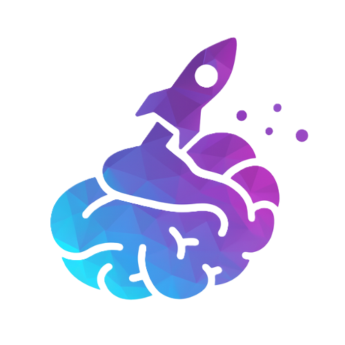

<div align="center">
  
  <h1>SkillDash</h1>
  <strong>The AI-Powered Skill Platform for Bangladesh’s Youth</strong>
  <br/><br/>
  
  
  
  
</div>

---

SkillDash is an **all-in-one, AI-powered platform** to bridge the skill gap for university and college students in Bangladesh.  
We transform career preparation into an engaging, gamified journey—helping you convert academic knowledge into real skills and connecting you directly to economic opportunities.

---

## ✨ Core Features

| Feature               | Description |
|-----------------------|-------------|
| 🔍 **AI Skill Quest** | A fun, interactive chat with our SkillBot AI analyzes your interests/aptitudes and reveals hidden talents. Answers the question: *"What am I good at?"* |
| 🎓 **Learn New Skills** | Get access to curated learning pathways and career courses tailored to your Skill Quest results. Build the job-ready skills employers need. |
| 📄 **AI Resume Feedback** | Receive instant, actionable resume feedback from our AI Coach, tailored for specific job openings. |
| 💼 **Find Opportunities** | Unlock exclusive access to a curated portal of part-time jobs and freelance gigs. Gain real-world experience and build your professional network. |

---

## 🛠️ Tech Stack

- **Framework:** [Next.js](https://nextjs.org/)
- **Language:** TypeScript
- **Styling:** Tailwind CSS
- **AI:** Google Gemini
- **Deployment:** Vercel

---

## 🚀 Getting Started

### **Prerequisites**

- [Node.js](https://nodejs.org/)
- [pnpm](https://pnpm.io/) (Install: `npm install -g pnpm`)

### **Setup**

1. **Clone the repository:**
    ```
    git clone https://github.com/zaifearsrepublic/skilldash.git
    ```

2. **Navigate into the project:**
    ```
    cd SkillDash
    ```

3. **Install dependencies:**
    ```
    pnpm install
    ```

4. **Run the development server:**
    ```
    pnpm dev
    ```

5. **Open [http://localhost:3000](http://localhost:3000) in your browser.**

---

## 🎯 About

A project for the [**GP AI Future Maker**](https://gpfuturemakers.com/) competition.  
Empowering Bangladesh's youth from classroom to career!

---

